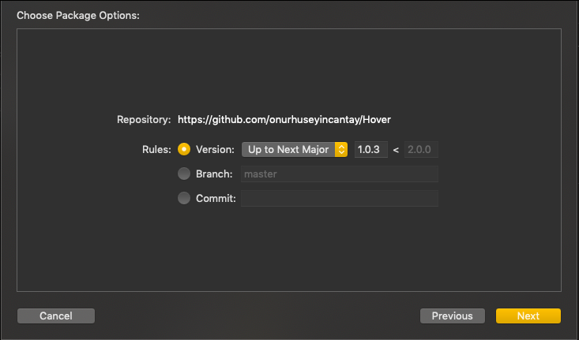

<p align="center">
  
</p>

# Version 1.0.4

[](https://github.com/onurhuseyincantay/Hover/blob/develop/License.md)[](https://cocoapods.org/pods/HoverKitSDK)
[](https://github.com/Carthage/Carthage)
[](https://github.com/apple/swift-package-manager)
</br>

## Currently Available
| Platform      | Version       |
| ------------- |:------------- | 
| iOS           | 13.0          |
| tvOS          | 13.0          |
| macOS         | 10.15         |
| watchOS       | 6.0           |
| macCatalyst   | 13.0          |

Hover is a Network layer which uses Apple's new framework `Combine` and provides async network calls with different kind of request functions.

## Why and When to Use
The main benefit to use Hover is to abstract the networking layer as much as possible and remove redunant code from your projects as we know `Apple` announced a new framework called `Combine` the main goal is to provide a declarative Swift API for processing values over time. These values can represent many kinds of asynchronous events, so networking calls are the most important async events, which actually needs to have a support for `Combine` to prevent and integrate Apple's native framework. Why you shouldnt use is when you dont have that much networking calls and also not so complex data flows to keep track on which means actually that you dont have states for the UI then dont use it. :) 

#### Cocoapods Installation
```swift
target 'MyApp' do
  pod 'HoverKitSDK', "~> 1.0.4"
end
```

#### Carthage Installation
```swift
github "onurhuseyincantay/Hover" ~> 1.0.4
```
**if you are using Xcode 12 there are additional steps to take:**
  1. create a carthage.sh file
  2. add the following code
  ```
set -euo pipefail

xcconfig=$(mktemp /tmp/static.xcconfig.XXXXXX)
trap 'rm -f "$xcconfig"' INT TERM HUP EXIT

# For Xcode 12 (beta 3+) make sure EXCLUDED_ARCHS is set to arm architectures otherwise
# the build will fail on lipo due to duplicate architectures.
echo 'EXCLUDED_ARCHS__EFFECTIVE_PLATFORM_SUFFIX_simulator__NATIVE_ARCH_64_BIT_x86_64__XCODE_1200 = arm64 arm64e armv7 armv7s armv6 armv8' >> $xcconfig
echo 'EXCLUDED_ARCHS = $(inherited) $(EXCLUDED_ARCHS__EFFECTIVE_PLATFORM_SUFFIX_$(EFFECTIVE_PLATFORM_SUFFIX)__NATIVE_ARCH_64_BIT_$(NATIVE_ARCH_64_BIT)__XCODE_$(XCODE_VERSION_MAJOR))' >> $xcconfig

export XCODE_XCCONFIG_FILE="$xcconfig"
carthage build "$@"

  ```
  3. use chmod +x carthage.sh to make it executable
  4. rather than running carthage run ./carthage-build.sh { any carthage command you need }

#### Swift Package Manager Installation
Package            |  branch
:-------------------------:|:-------------------------:
  |   


# Sample Usage
#### Provide Target
```swift
 enum UserTarget {
  case login(email: String, password: String) 
 }
 
 extension UserTarget: NetworkTarget { 
    var path: String {
        switch self {
        ...
    }
    var providerType: AuthProviderType {
        ...
    }
    
    var baseURL: URL {
        ...
    }
    
    var methodType: MethodType {
        switch self {
          ...
        }
    }
    
    var contentType: ContentType? {
        switch self {
         ...
        }
    }
    
    var workType: WorkType {
        switch self {
          ...
        }
    }
    
    var headers: [String : String]? {
        ...
    }
 }
```
#### Request With Publisher
```swift
let provider = Hover()
let publisher = provider.request(
            with: UserTarget.login(email: "ohc3807@gmail.com", password: "123456"),
            scheduler: DispatchQueue.main,
            class: UserModel.self
        )
...
publisher.sink({ ... })
```

#### Request With Subscriber
```swift
let provider = Hover()
let userSubscriber = UserSubscriber()
provider.request(with: UserTarget.login(email: "ohc3807@gmail.com", password: "123456"), class: UserModel.self, subscriber: userSubscriber)
```

Tested with [JsonPlaceholder](https://jsonplaceholder.typicode.com)
Inspired By [Moya](https://github.com/Moya/Moya) Developed with 🧡

