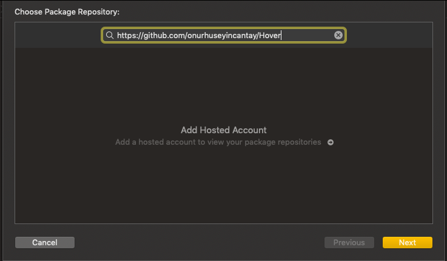
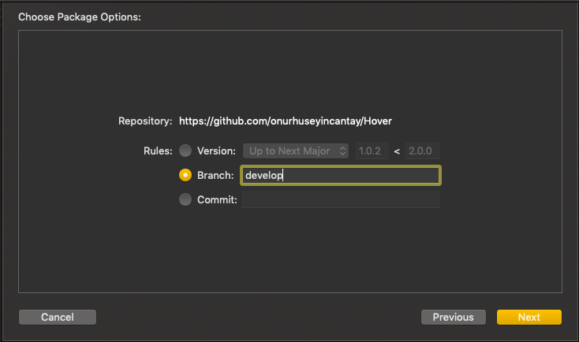

# Hover
[](https://github.com/onurhuseyincantay/Hover/blob/develop/License.md)[](https://cocoapods.org/pods/HoverKitSDK)
[](https://github.com/Carthage/Carthage)
[](https://github.com/apple/swift-package-manager)</br>

## Currently Available
| Platform      | Version       |
| ------------- |:------------- | 
| iOS           | 13.0          |
| tvOS          | 13.0          |
| macOS         | 10.15         |
| watchOS       | 6.0           |
| macCatalyst   | 13.0          |

Hover is a Network layer which uses Apple's new framework `Combine` and provides async network calls with different kind of request functions.
#### Cocoapods Installation
```swift
target 'MyApp' do
  pod 'HoverKitSDK', '~> 1.0.2'
end
```

#### Carthage Installation
```swift
github "onurhuseyincantay/Hover" ~> 1.0.2
```

#### Swift Package Manager Installation
Package            |  branch
:-------------------------:|:-------------------------:
  |   


# Sample Usage
#### Provide Target
```swift
 enum UserTarget {
  case login(email: String, password: String) 
 }
 
 extension UserTarget: NetworkTarget { 
    var path: String {
        switch self {
        ...
    }
    var providerType: AuthProviderType {
        ...
    }
    
    var baseURL: URL {
        ...
    }
    
    var methodType: MethodType {
        switch self {
          ...
        }
    }
    
    var contentType: ContentType? {
        switch self {
         ...
        }
    }
    
    var workType: WorkType {
        switch self {
          ...
        }
    }
    
    var headers: [String : String]? {
        ...
    }
 }
```
#### Request With Publisher
```swift
let provider = Hover()
let publisher = provider.request(
            with: UserTarget.login(email: "ohc3807@gmail.com", password: "123456")
            class: UserModel.self
        )
...
publisher.sink({ ... })
```

#### Request With Subscriber
```swift
let provider = Hover()
let userSubscriber = UserSubscriber()
provider.request(with: UserTarget.login(email: "ohc3807@gmail.com", password: "123456"), class: UserModel.self, subscriber: userSubscriber)
```

Tested with [JsonPlaceholder](https://jsonplaceholder.typicode.com)
Inspired By [Moya](https://github.com/Moya/Moya/blob/master) Developed with 🧡

